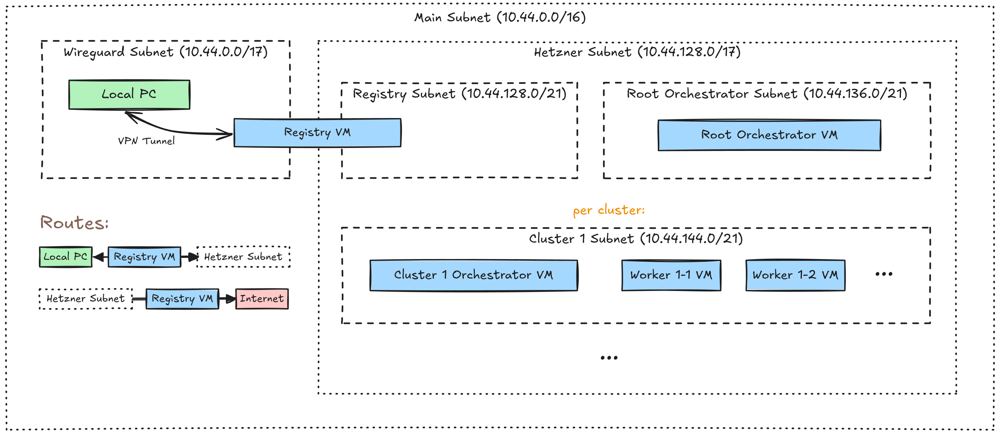

# Oakestra Terraform Setup for Development Deployment on Hetzner Cloud

This repository contains a Terraform project for deploying a development Oakestra setup on Hetzner Cloud.

## Prerequisites

Before you begin, ensure you have the following installed and configured:

1. **Required Tools**
   * [Terraform](https://developer.hashicorp.com/terraform/install) or [OpenTofu](https://opentofu.org/docs/intro/install/)
   * [WireGuard (Tools)](https://www.wireguard.com/install/)
2. **Optional Tools** 
   * [pv](https://wiki.ubuntuusers.de/pv/) for progress indicators 
3. **Root Privileges**
   * Your user needs to have root privileges on your local machine (e.g. via `sudo`).

## Quick Start Guide

1. **Clone this Repository**
2. **Configure Variables**:
   * Create a `.tfvars` file to customize your deployment (e.g. `oakestra.tfvars`).
3. **Initialize Terraform**:
   * `$ terraform init`
4. **Deploy the Infrastructure**:
   * `$ terraform apply -var-file="oakestra.tfvars"`
5. **Interact with the Setup**
   * see next section

## Interacting with the Setup

After deployment, Terraform will generate a Bash script at `${XDG_DATA_HOME}/oakestra-dev/<setup-name>/init.sh`
(e.g. `~/.local/share/oakestra-dev/oak/init.sh`). 
Sourcing this script (e.g. `$ . ~/.local/share/oakestra-dev/oak/init.sh`) will make a new commands
available in your shell for interacting with the Oakestra components.
The first command you will need to run is `<setup-name>-up` to connect to the just created Oakestra setup.

> [!TIP]
> If you don't want to manually source the generated `init.sh` script everytime you start a new shell,
> you can automatically do it in your shell initialization script, for example:
> - **.bashrc**: `for oak_init in ~/.local/share/oakestra-dev/*/init.sh; do [ -e "${oak_init}" ] && . "${oak_init}"; done`
> - **.zshrc**: `for oak_init in ~/.local/share/oakestra-dev/*/init.sh(N); do . "${oak_init}"; done`

### Commands

- **`<setup-name>-up`**:
  - Setup WireGuard tunnel to nodes deployed on Hetzner Cloud.
  - Uses `sudo` internally, will ask for your user's password.
- **`<setup-name>-down`**
  - Tears down WireGuard tunnel to nodes deployed on Hetzner Cloud.
  - Uses `sudo` internally, will ask for your user's password.
- **`<setup-name>-ssh <node-name>`**:
  - Connect to any node of the setup via SSH.
  - Naming scheme of the nodes (with indices starting at one):
    - Container Registry: `registry`   
    - Root Orchestrator: `root-orc`
    - Cluster Orchestrator C: `cluster-<C>-orc`
    - Worker W (in Cluster C): `worker-<C>-<W>`
  - Examples:
    - `$ oak-ssh root-orc`
    - `$ oak-ssh cluster-1-orc`
    - `$ oak-ssh worker-2-1`
- **`<setup-name>-image-push <image-name>`**:
  - Pushes a container image to the setup, replacing affected, running containers automatically.
  - The host/port and version parts of the image name don't matter, just the actual name has to match.
  - Examples:
    - `$ oak-image-push oakestra/oakestra-net/root-service-manager:development`
    - `$ oak-image-push ghcr.io/oakestra/oakestra-net/root-service-manager:v0.4.400`
- **`<setup-name>-nodeengine-push <node-engine-bin> <node-engined-bin>`**
  - Updates and restarts the `nodeengine` service on all worker nodes.
  - Example: `$ oak-nodeengine-push ./NodeEngine_arm64 ./nodeengined_arm64`
- **`<setup-name>-netmanager-push <net-manager-bin>`**
  - Updates and restarts the `netmanager` service on all worker nodes.
  - Example: `$ oak-netmanager-push ./arm64-NetManager`

> [!IMPORTANT]  
> Make sure to run `$ <setup-name>-down` before using `$ tf destroy` or `$ tofu destroy`,
> to make sure the WireGuard tunnel is properly removed.
> If your forgot to do this, you can remove the WireGuard network interface manually with `$ sudo ip link del wg-<setup-name>`.

## Proxy

When the `proxy_client_count` variable is greater than 0, Terraform will configure an additional Hetzner server
that acts as a proxy and allows external servers to connect to the local network of the setup.
From now on these external servers will be referred to as proxy clients.

This is implemented with Wireguard VPN tunnels, for which you can get the configs for all proxy clients
via the `proxy_client_config_udp` or `proxy_client_config_tcp` outputs.
If you want to use the **TCP** variant, you need to install [udp2raw](https://github.com/wangyu-/udp2raw) on the proxy client.
To install the latest version, you can use this shell one-liner, which installs the binary to `/usr/local/bin`:
- *ARM64* (with hardware AES support): `$ curl -Ls https://github.com/wangyu-/udp2raw/releases/latest/download/udp2raw_binaries.tar.gz | sudo tar -xzf - --transform='s|udp2raw_arm_asm_aes|udp2raw|' -C /usr/local/bin udp2raw_arm_asm_aes`
- *AMD64* (with hardware AES support): `$ curl -Ls https://github.com/wangyu-/udp2raw/releases/latest/download/udp2raw_binaries.tar.gz | sudo tar -xzf - --transform='s|udp2raw_amd64_hw_aes|udp2raw|' -C /usr/local/bin udp2raw_amd64_hw_aes`

## Network Architecture

